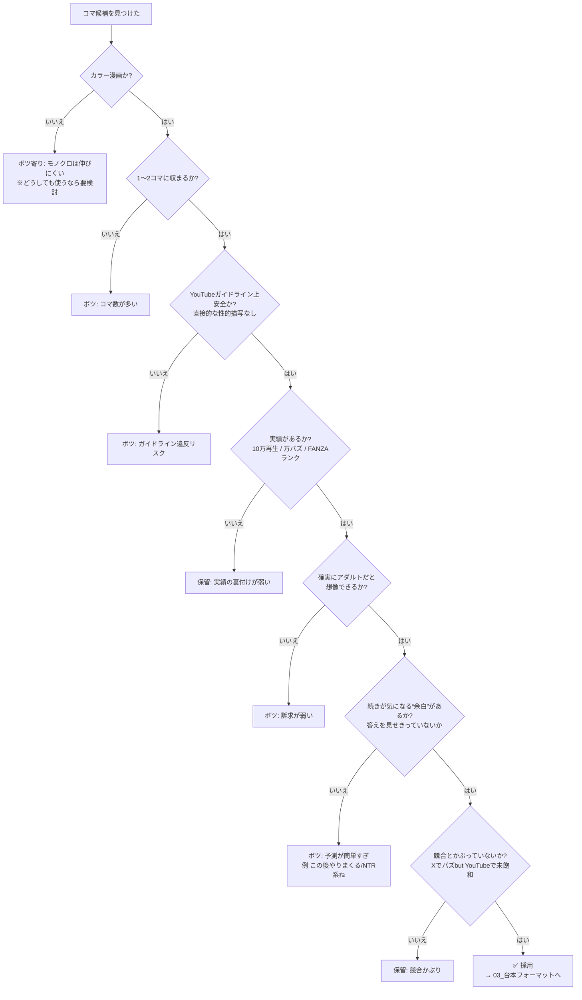

# コマ選定 判定フローチャート

ネタ（コマ）を見つけたとき、「採用してよいか」を判定するためのフロー。
**1つでも ❌ が出たら原則ボツ（または保留）**。

---

## フローチャート（Mermaid）

---

## テキスト版チェック（上から順に。すべて Yes で採用）

1. **カラー漫画か？** → No なら原則ボツ（モノクロは総合的に伸びにくい）
2. **1〜2コマに収まるか？** → No ならボツ
3. **YouTubeガイドライン上、安全か？**（直接的な性的描写なし）→ No ならボツ
4. **実績があるか？**（他で10万再生 / X万バズ / FANZAランク掲載）→ No なら保留
5. **確実にアダルトだと想像できるか？**（直接表現なしでも）→ No ならボツ（訴求が弱い）
6. **続きが気になる“余白”があるか？** → No ならボツ
   - ✗ 悪い例：「この後この人がやりまくるんでしょ」「NTR系ね」＝先が読めすぎ
   - ✓ 良い例：アダルトと分かるが、結末は見せていない
7. **競合とかぶっていないか？**（XでバズだがYouTubeでは未飽和が理想）→ かぶり大なら保留

---

## ネタの探し場所（ネタ元）

1. ベンチマークアカウントの伸びている投稿
2. ショートフィードで回ってきた **10万再生超え**
3. X の漫画紹介系アカウントの **万バズ投稿**

---

## ひとことメモ
最重要は **6番の「余白」**。
「アダルトだと分かる」×「でも結末は見せない」＝視聴者が続きを想像し、止めて／繰り返し見て、作品本編（FANZA）へ向かう、という導線を意識する。
